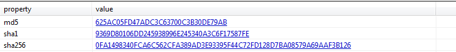

# PMA-CH1-labs

## lab 01-01

### Q1

To upload the malware, I need to get the hashes to get the hashes I will use pestudio.

Then I am going to upload it in virustotal.com

So, U can see that there are 55/71 antivirus signatures. I can get more info from virustotal like

### Q2

To get the compiled date of these filed we will use peview. I will find this info in IMAGE_FILE_HEDER (IMAGE_NT_HEADERS > IMAGE_FILE_HEDER)

As U can see here it was compiled in 2010/12/19.

### Q3

Here I need to know if this malware is packed or not, I will use peview to check Virtual Size
And Size of Raw Data in IMAGE_SECTION_HEADER.text If they R equal that is means it is not backed.

### Q4

We need to check the imports so I will use pestudio.

Lab01-01.exe

Lab01-01.dll
As U can see their R many imports some of them will give U important info and the rest is not important.
I will use [malapi](https://malapi.io/) to get info about suspicious imports.

* From Lab01-01.exe u can find that:
  * CreateFileMappingA
    from it is name it is creating something  when u open it in malapi it will give u this info "that loads a file into memory and makes it accessible via memory addresses" so u can Guess u will find an ip.
  * FindNextFileA
  * FindFirstFileA
    U can guess from these two functions that the malware is searching in the directories for some reason.
  * CopyFileA
    this functions is copying existing file
* From Lab01-01.exe u can find:
  * CreateProcessA

from these two files we can say that these files r searcing for something and creating something.

### Q5

C:\windows\system32\kerne132.dll u can find that in Lab01-01.dll. u will ask me where is the problem? it supose to be **kernel** not **kerne1**

### Q6

in strings u will find this ip 127.26.152.13

### Q7

i think this malware is downloading files to my machine

## lab 01-02

### Q1

To upload the malware, I need to get the hashes to get the hashes I will use pestudio.

Then I am going to upload it in virustotal.com

 So, U can see that there are 54/70 antivirus signatures. I can get more info from virustotal like

### Q2

it is packed file with UPX why?

here u can see that there is upx after sections and headers that is mean it is packed. to unpack it i will use UPX

### Q3

We need to check the imports so I will use pestudio:

* InternetOpenUrlA
* InternetOpenA
* CreateServiceA
* StartServiceCtrlDispatcherA
  
i think we will find url. this malware is creating something and it is connecting the main thread of the process to the service control manager.

### Q4

we will check strings with pestudio u wil find this URL http^://www.malwareanalysisbook.com

## lab01-03

### Q1

To upload the malware, I need to get the hashes to get the hashes I will use pestudio.

Then I am going to upload it in virustotal.com 

 So, U can see that there are 60/70 antivirus signatures. I can get more info from virustotal like

 

### Q2

it is packed file why?

virtual size is >>>> size of raw data and we can use peid

I can say that it is packed with FSG , I can not unpack it now.

### Q3

now i can not

### Q4

now i can not

## lab01-04

### Q1

To upload the malware, I need to get the hashes to get the hashes I will use pestudio.

Then I am going to upload it in virustotal.com

 So, U can see that there are 58/70 antivirus signatures. I can get more info from virustotal like

### Q2

no it is not packed why?

because virtual size is nearly equal to size of raw data

### Q3

i well use peview

it was combiled in 2019/08/30

### Q4

important impors:

* WriteFile
* CreateFileA
* MoveFileA
* WinExec
* OpenProcess
i do not knoe but it is creating something.

### Q5

I will try to check strings i found:

* http^://www.practicalmalwareanalysis.com/updater.exe
* \system32\wupdmgrd.exe

### Q6

How to check if there is recource? u can find it in pestudio in resources section

and u can find it in peview

To extract it I will use resource hacker action --> save resource to a binary file

now i need to analys it. so i need to get it is hash wich is -u can get it from pestudio- 6A95C2F88E0C09A91D69FFB98BC6FCE8 MD5.
Then u can upload it to virustotal:

I need to check imports:

There r some interesting imports:

* URLDownloadToFileA
* WinExec

i think this binary is downloading something so i think i will find a URL. So i need to check strings ,i found:

* http^://www.practicalmalwareanalysis.com/updater.exe
* \system32\wupdmgrd.exe

# PMAT-lab

## Q1

to get the hash i will use pestudio 0C82E654C09C8FD9FDF4899718EFA37670974C9EEC5A8FC18A167F93CEA6EE83

## Q2

the architecture is 32-bit

## Q3

U can see that there are 59/70 antivirus signatures. I can get more info from virustotal like

## Q4

i can not get important info from strings section why? because there is too many strings

## Q5

i will check imports there a lot i think it will be hard to get info from it

## Q6

no it is not packed why?

* I can see the hearders

* virtual size is nearly equal to size of raw data

